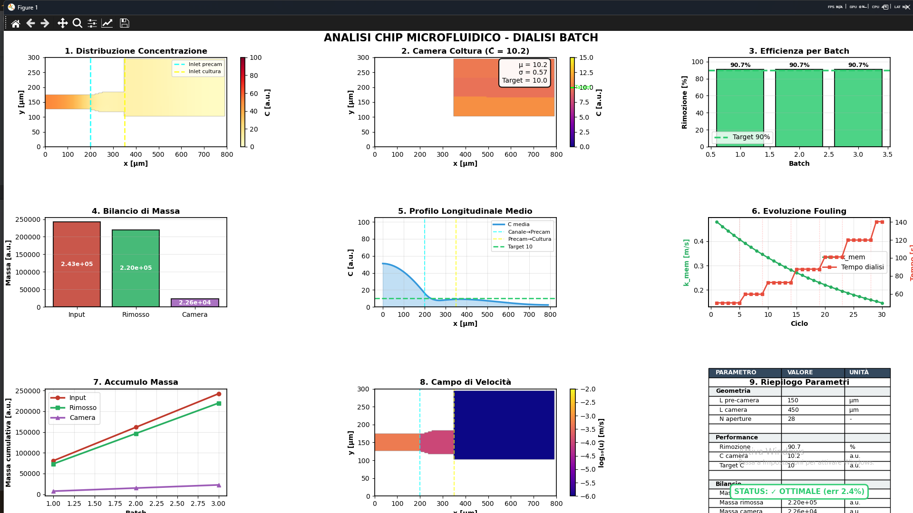
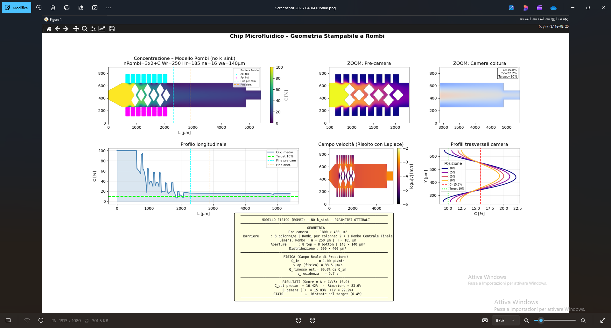

# 🧫 Microfluidic Digital Twins: Nanoparticle Dynamics

## About The Project
This repository contains computational models (Digital Twins) of microfluidic chips designed for nanoparticle analysis. The scripts simulate the physical and fluid-dynamic behaviors of particles inside micro-chambers, solving differential equations to predict concentration over time and capture efficiency.

## Key Features & Models
* **`chip_fisico_altezza.py`**: Simulates the physical capture of nanoparticles based on fluid velocity, channel height, and obstacle interaction. It calculates the probability of particle-sensor collisions.
* **`chip_batch_plot_con_uscita.py`**: Models the concentration dynamics across multiple sequential micro-chambers over time. It tracks particle accumulation and washout using mass balance principles.
* **Mathematical Modeling**: Utilizes Ordinary Differential Equations (ODEs) via `scipy.integrate` to model kinetics.
* **High-Performance Computing**: Leverages `@njit` (Numba) for rapid, compiled calculation of complex fluid-dynamic arrays.

## 🛠️ Technologies
* **Language**: Python
* **Math & Physics**: `NumPy`, `SciPy` (`odeint`)
* **Performance Optimization**: `Numba`
* **Data Visualization**: `Matplotlib`

## Author Profile & Background
**Lorenzo Panunzio**
I combine a strong background in biology (MSc from Sapienza University) with computational data science to build predictive mathematical models for bioengineering applications.
* ## Simulation Results

## Simulation Results

### Concentration Dynamics Over Time (Sequential Micro-chambers)

### Nanoparticle Capture Probability based on Fluid Velocity

**Relevant Certifications:**
* Python for Everybody (Specialization, With Honors)* - University of Michigan
* Python for Genomic Data Science* - Johns Hopkins University

